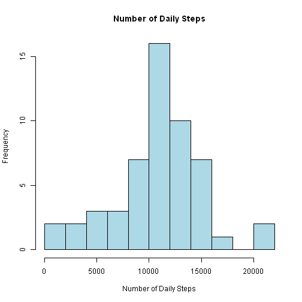
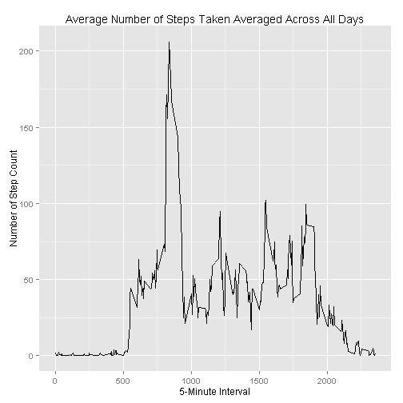
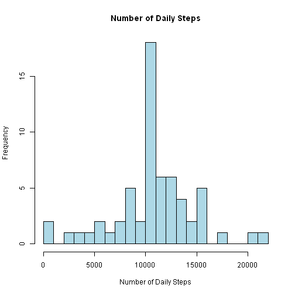
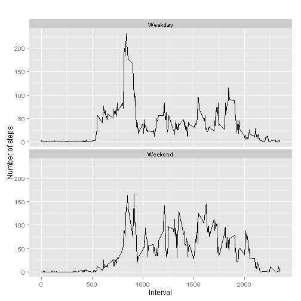

##Loading and preprocessing the data

```r
activity <- read.csv("activity.csv") 
activity_clean <- activity[complete.cases(activity),]
```

###Load the ggplot2 package

```r
library(ggplot2)
```
###What is mean total number of steps taken per day?

```r
daily_steps <- aggregate(steps ~ date, data = activity_clean, sum)
daily_steps_avg <- mean(daily_steps$steps)
daily_steps_avg
```

```
## [1] 10766.19
```
##Make a histogram of the total number of steps taken each day

```r
hist(daily_steps$steps, xlab="Number of Daily Steps", main="Number of Daily Steps", breaks=10,col="light blue")
```

 

##Calculate and report the mean and median of the total number of steps taken per day

```r
mean(daily_steps$steps)
```

```
## [1] 10766.19
```

```r
median(daily_steps$steps)
```

```
## [1] 10765
```

##Time series plot of Number of steps taken over 5 min intervals


```r
library(plyr)
interval_avg<-aggregate(steps ~ interval, data = activity_clean, mean)

qplot(x=interval, y=steps, data=interval_avg, geom = "line",
      xlab="5-Minute Interval",
      ylab="Number of Step Count",
      main="Average Number of Steps Taken Averaged Across All Days"
      )
```

 

##Which 5-minute interval, on average across all the days in the dataset, contains the maximum number of steps?

```r
max_id<-which.max(interval_avg$steps)
interval_avg[max_id,]
```

```
##     interval    steps
## 104      835 206.1698
```

##Calculate and report the total number of missing values in the dataset 


```r
sum(!complete.cases(activity))
```

```
## [1] 2304
```

##Filling NA values with averages for a particular interval
The strategy adopted is to fill NA values with average value of the steps for that interval across all days

```r
activity_imputed<-activity ## create a copy of the dataset
for(i in 1:nrow(activity_imputed))
        {
        if(is.na(activity_imputed$steps[i]==TRUE)) 
               {
                for(y in 1:nrow(interval_avg))
                        {if(interval_avg$interval[y]==activity_imputed$interval[i])
                                {
                                        activity_imputed$steps[i]<-interval_avg$steps[y]
                                }
                        }
                }    
        }                       
```

##Histogram of the new Dataset

```r
daily_steps_imputed <- aggregate(steps ~ date, data = activity_imputed, sum)
daily_steps_avg_imputed <- mean(daily_steps_imputed$steps)
daily_steps_avg_imputed
```

```
## [1] 10766.19
```

```r
hist(daily_steps_imputed$steps, xlab="Number of Daily Steps", main="Number of Daily Steps", breaks=20,col="light blue")
```

 

##What is the impact of imputing missing data on the estimates of the total daily number of steps?
there is no major impact

```r
median(daily_steps_imputed$steps)
```

```
## [1] 10766.19
```

##Flag days as weekends or weekdays and update the imputed dataset


```r
for (i in 1:nrow(activity_imputed))
        {
        if (weekdays(as.Date(activity_imputed$date[i])) == "Saturday" | weekdays(as.Date(activity_imputed$date[i])) == "Sunday")
                {
                        activity_imputed$day_flag[i]<-"Weekend"
                }
                else
                {
                activity_imputed$day_flag[i] <-"Weekday"
                }
                
        }
```

##Time series plot with modified dataset


```r
imputed_steps_by_interval <- aggregate(steps ~ interval + day_flag, activity_imputed, mean)

qplot(interval, steps, data = imputed_steps_by_interval, type = 'l',geom=c("line"), xlab = "Interval", ylab = "Number of steps", main = "")+ facet_wrap(~day_flag, ncol = 1)
```

 

Inference: During the weekend, the person is busier during later prt of the day. During weekdays, the person is busy during first half of the day.
